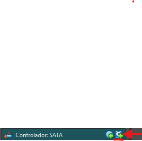

# **Guia: Gestió d’emmagatzematge amb Storage Spaces a Windows 11**

---

## 2.1 Creació del Pool d’emmagatzematge

### **Objectiu**
Crear un *Storage Pool* utilitzant tres discos virtuals de 10 GB de manera inicial com a base per a la resta de configuracions.

### **Procediment Creació Maquina**
1. Crear la maquina amb **4 GB de RAM** i **2 processadors**

3. Anem a l'apartat **d'Emmagatzematge** i a l'opcio de **Controlador: SATA** seleccionem l'opcio de **Afegeix disc dur** hi ha **Crea**

 
4. Canviem el nom a disc01 o similar i assignem **10 GB d'espai**

   
6. Creem i l'escollim. I repetim aquest proces dos cops mes per començar a fer els grups

### **Captura de pantalla resultat final**

### **Procediment Creació del Grup**
1. Entrem a la maquina, obrim **Tauler de control → Sistema i seguretat → Espais d’emmagatzematge**.   
2. Seleccionem **Crea un grup nou i un espai d’emmagatzematge nou**.
3. Seleccionar els discos necesaris de **10 GB cadascun**.
4. Assignar un nom al grup.
5. I confirmem la creacio del grup.

### **Captures de pantalla**
_Afegir aquí les captures de la creació del pool i la vista dels discos._

### **Verificació**
El pool s’ha creat correctament amb tres discos i apareix disponible per crear espais d’emmagatzematge.

---

## 2.2 Resiliència de mirall doble (Two-Way Mirror)

### **Objectiu**
Configurar un espai amb **mirall doble** per garantir la disponibilitat de les dades en cas de fallada d’un disc.

### **Procediment**
1. Dins del grup que hem creat anteriorment, fer clic a **“Crea un espai d’emmagatzematge nou”**.  
2. Configurar:
   - Tipus de resiliència: `Mirall bidireccional (Two-way mirror)`  
   - Mida: `10 GB`  
   - Lletra d’unitat: `E:`  
3. Copiar alguns fitxers de prova a la unitat `E:`.  
4. Deshabilitar un dels discos del pool per **simular una fallada**.  
5. Verificar que els fitxers continuen accessibles.  
6. Tornar a habilitar el disc i comprovar la **reconstrucció automàtica**.

### **Captures de pantalla**
_Afegir aquí les captures de la creació, la fallada simulada i la reconstrucció._

### **Verificació**
Els fitxers tornan a ser accessibles després de la fallada i la reconstrucció es realitza automàticament.

---

## 2.3 Resiliència de paritat

### **Objectiu**
Crear un espai amb **resiliència de paritat** per mantenir les dades amb menys espai dedicat a còpies.

### **Procediment**
1. Dins del mateix pool, crear un nou espai:  
   - Tipus: `Paritat`  
   - Mida: `10 GB`  
   - Lletra d’unitat: `F:`  
2. Copiar fitxers de prova a la unitat `F:`.  
3. Deshabilitar un disc per simular una fallada.  
4. Verificar que les dades segueixen accessibles.  
5. Reactivar el disc i comprovar la reconstrucció.

### **Captures de pantalla**
_Afegir aquí les captures del procés i comprovació._

### **Verificació**
L’espai de paritat permet l’accés a les dades durant la fallada i es reconstrueix correctament després.

---

## 2.4 Resiliència de mirall triple (Three-Way Mirror)

### **Objectiu**
Configurar un espai amb **mirall triple** per protegir les dades davant la fallada simultània de dos discos.

### **Procediment**
1. Crear un nou espai dins del pool:  
   - Tipus: `Mirall de tres vies (Three-way mirror)`  
   - Mida: `10 GB`  
   - Lletra d’unitat: `G:`  
2. Copiar fitxers de prova a la unitat `G:`.  
3. Deshabilitar dos discos per simular una fallada múltiple.  
4. Verificar que els fitxers continuen accessibles.  
5. Reactivar els discos i comprovar la reconstrucció.

### **Captures de pantalla**
_Afegir aquí les captures del procés i de la reconstrucció._

### **Verificació**
Les dades continuen accessibles malgrat la fallada de dos discos. El sistema reconstrueix el mirall automàticament.

---

## Conclusió

Els resultats mostren que:
- El **mirall doble** ofereix protecció davant una fallada individual.  
- La **paritat** és més eficient en ús d’espai, tot i que més lenta en reconstrucció.  
- El **mirall triple** proporciona el màxim nivell de seguretat davant múltiples fallades.

En conclusió, **Storage Spaces** és una eina molt útil per a la gestió d’emmagatzematge amb redundància dins d’un entorn Windows professional.

---

