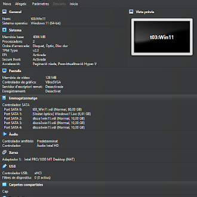

# 2. Part Windows: Espais d'Emmagatzematge (Storage Spaces)

## Configuració inicial: 

### Creació d'un Storage Pool: 

Per començar crearem un pool d'emmagatzematge inicialment amb tres discos de 10 GB, per poder fer aixo entrarem al emmagetzematge de la nostra maquina i a l'apartat Controlador Sata crearem un de nou, aquest l'hi ficarem un nom com disc01 i seguidament l'hi assignarem els 10 GB d'emmagetzematge, aquest process el repetirem 2 cops mes.

captures d'exemple de com ha de quedar:

