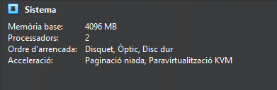
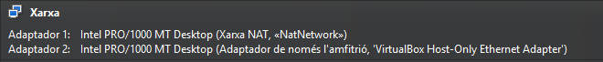
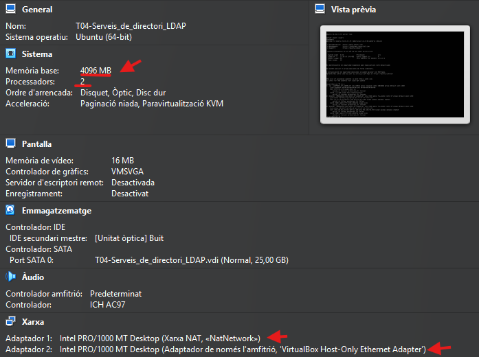
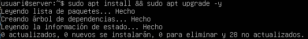
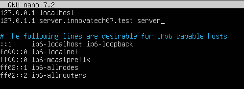
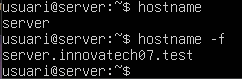
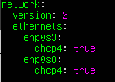
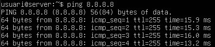
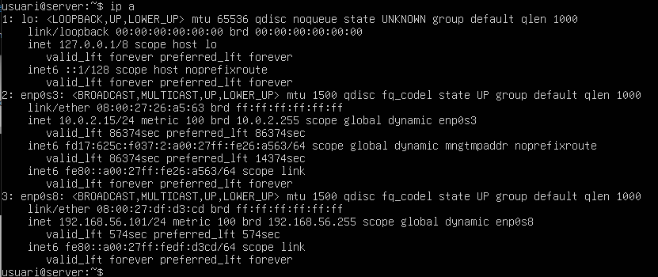

## 2. Requeriments d'Infraestructura Inicial

**R.INF.01** -
Configuració de la màquina Server (Server Hostname). server.innovatechXX.test 

- Configuracio de la maquina:
  






- Actualitza:
```
sudo apt install && sudo apt upgrade -y
```



- Hostname:

```
sudo nano /etc/hosts
```





Comanda per si necesitas canviar el nom del server: 
```
sudo hostnamectl set-hostname nom
```

**R.INF.02** -
Interfície de Xarxa Pública. NAT (Per accés a Internet i descàrrega de paquets).

**R.INF.03** -
Interfície de Xarxa Privada. Host-Only (Per a comunicació privada amb el Client virtual  i la màquina física).

Comandes:
```
sudo nano /etc/netplan/50-cloud-init.yaml
```
```
sudo netplan apply
```
- Configuracio xarxa




- Comprovació




---

Click aqui per anar a [TASQUES D'IMPLEMENTACIO I CONFIGURACIO DEL SERVIDOR LDAP](Tasques-d'Implementació-i-Configuració-del-Servidor-LDAP.md)

Click aqui per anar a [INTEGRACIÓ DE CLIENT](Integració-de-Client.md)

Click aqui per anar a [HOME](...)

Click aqui per anar a [README](README.md)
